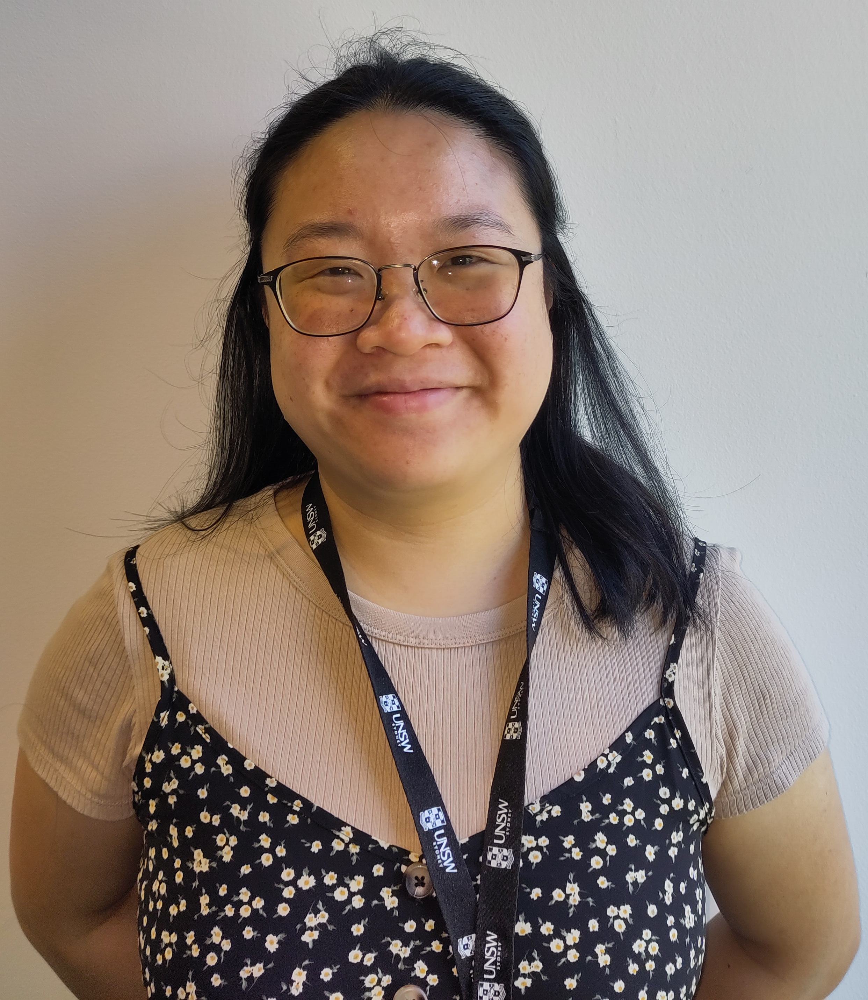
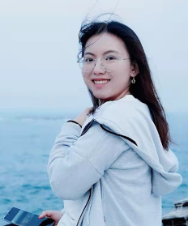
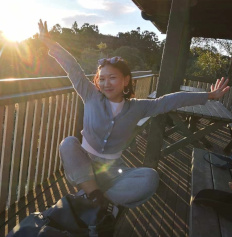
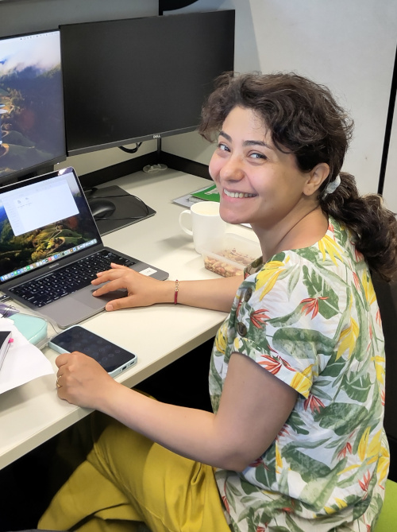
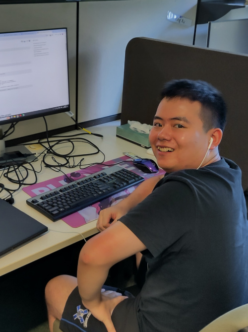
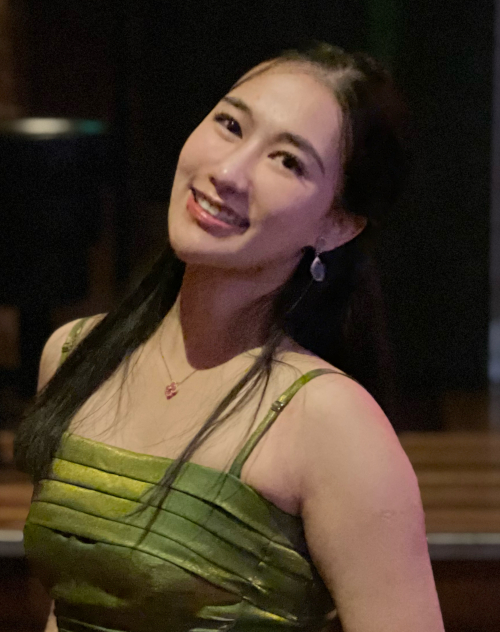
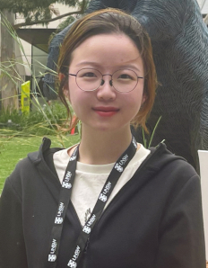
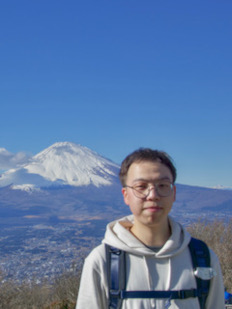
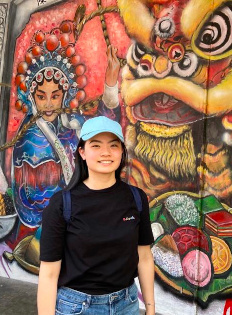
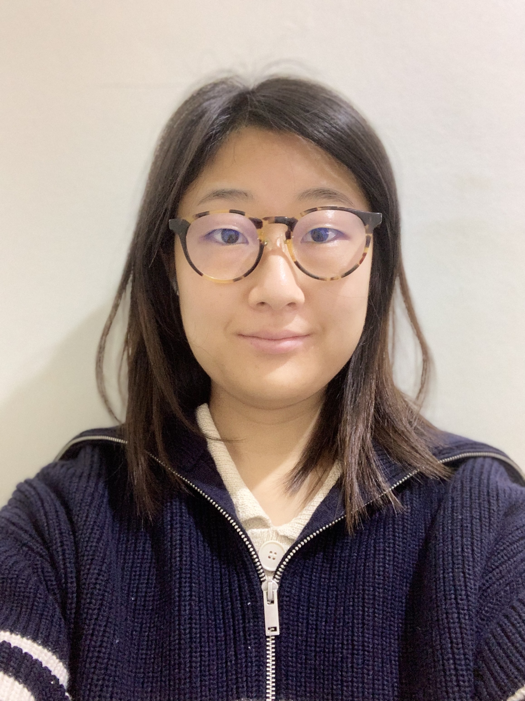

title: People
slug: people
category: pages
order: 3
date: 2019-12-02
template: people

<!--
<h1>Team</h1>
-->

<h2>Fabio Zanini</h2>

<a href="mailto:fabio.zanini@unsw.edu.au">fabio DOT zanini AT unsw DOT edu DOT&nbsp;au</a>

<ul>
<li><a href="../images/fabio_zanini_cv.pdf"><strong>Curriculum&nbsp;Vitae</strong></a></li>
<li><a href="https://research.unsw.edu.au/people/associate-professor-fabio-zanini"><strong>UNSW&nbsp;profile</strong></a></li>
</ul>

I love single cell biology, data science, graphs, coding, fighting viral infections, the immune system, and rock&nbsp;climbing.

<h2>Priscilla&nbsp;Boon</h2>

<a href="mailto:p.boon@unsw.edu.au">p DOT boon AT unsw DOT edu DOT&nbsp;au</a>

I love working at the interphase of computer science and biology. I enjoy interpreting and deciphering meaning from all kinds of biological data. Outside of work I enjoy eating and cooking really good food and making things with my hands. 

<h2>Ying&nbsp;Xu</h2>

<a href="mailto:yingxu3@unsw.edu.au">yingxu3 AT unsw DOT edu DOT&nbsp;au</a>

I am a Software Engineer working on cell atlas approximations and human-machine interfaces. Outside of work, I like photography, swimming, and cats.

<!--

<h2>Keyi&nbsp;Jiang</h2>

<a href="mailto:g.putri@unsw.edu.au">g DOT putri AT unsw DOT edu DOT au</a>

TBD

-->

<!--

<h2>Givanna&nbsp;Putri</h2>

co-supervised: <a href="https://medicalsciences.med.unsw.edu.au/people/associate-professor-john-pimanda">John Pimanda</a>

<a href="mailto:g.putri@unsw.edu.au">g DOT putri AT unsw DOT edu DOT au</a>

I am a postdoctoral research fellow with passion for single cell omics and computational biology, specifically using data science techniques to analyse multi-omics data and investigate biological system. When not working, I enjoy mountain biking, painting, travelling, and listening to blues and jazz music.

-->

<!--

<h2>Kanu&nbsp;Wahi</h2>

co-supervised: <a href="https://medicalsciences.med.unsw.edu.au/people/associate-professor-jeff-holst">Jeff Holst</a> and <a href="https://www.ccia.org.au/molecular-targets-and-cancer-therapeutics/metal-targeted-therapy-and-immunology">Orazio Vittorio</a>

<a href="mailto:k.wahi@unsw.edu.au">k DOT wahi AT unsw DOT edu DOT au</a>

I am a postdoctoral research fellow with a keen interest in identifying resistance mechanisms in aggressive subtypes of breast cancer caused by dysregulation at the transcript level through to the metabolic level. Apart from work, I enjoy going for bike rides and bush walks.

-->

<!--

<h2>Zhiyuan&nbsp;Yao</h2>

co-supervised: <a href="https://med.stanford.edu/einavlab/people.html">Shirit Einav</a> @&nbsp;Stanford

<a href="mailto:yzhiyuan@stanford.edu">yzhiyuan AT stanford DOT&nbsp;edu</a>

I am a postdoctoral scholar with an interest in single cell biology and virology, especially using single cell transcriptomic tools
to investigate virus-host interplay in severe&nbsp;dengue.

-->

<!--

<h2>Toni Rose&nbsp;Jue</h2>

co-supervised: <a href="https://medicalsciences.med.unsw.edu.au/people/associate-professor-jeff-holst">Jeff Holst</a>

<a href="mailto:t.jue@unsw.edu.au">t DOT jue AT unsw DOT edu DOT&nbsp;au</a>

I am a postdoctoral scholar and my research interest revolve around the use of next generation sequencing technologies
to understand the mechanisms of immunotherapeutic strategies for malignant primary brain tumours, specifically glioblastoma.
Beyond work, I love travelling and exploring the outdoors with my husband and&nbsp;daughter.

-->

<!--

<h2>Yike&nbsp;Xie</h2>

<a href="mailto:yike.xie@unsw.edu.au">yike DOT xie AT unsw DOT edu DOT&nbsp;au</a>

I am a PhD student and my background is in pharmacy. My research interests are data analysis and single cell sequencing.
Outside of work, I like reading and&nbsp;traveling.

-->

<!--

<h2>Kevin&nbsp;Zhu</h2>

<a href="mailto:kv.zhu999@gmail.com">kv DOT zhu999AT gmail DOT&nbsp;com</a>

I'm a undergraduate student with an interest in computer science and mathematics, particularly when I'm able to visualise the data that I'm working with! Outside of work, I love to draw and play Overwatch with my friends.

-->

<h2>Catherine&nbsp;Gatt</h2>

<a href="mailto:c.gatt@unsw.edu.au">c DOT gatt AT unsw&nbsp;DOT&nbsp;edu DOT&nbsp;au</a>

I am a PhD student with a keen interest in computational biology, single-cell transcriptomics and evolution.  Beyond studying, I love scuba diving and hiking. 

<h2>Sara&nbsp;Shavandi</h2>

<a href="mailto:s.shavandi@unsw.edu.au">s DOT shavandi AT unsw&nbsp;DOT&nbsp;edu DOT&nbsp;au</a>

I am a PhD student and I love biology, specially bioinformatics. Apart from science I am a big fan of nature and love hiking and climbing. Also, I love literature and Philosophy.

<h2>Michael&nbsp;Li</h2>

<a href="mailto:yijie.li.1@student.unsw.edu.au">yijie DOT li DOT 1 AT student DOT&nbsp;unsw DOT&nbsp;edu  DOT&nbsp;au</a>

I am an (incoming) PhD student with a keen interest in computational biology, and studies about how machine learning can be used in general medicine & health area. Beyond studying, I love playing badminton and video games.

<h2>Liuyi&nbsp;Chen</h2>

<a href="mailto:liuyi.chen1@unsw.edu.au">liuyi DOT chen1 AT &nbsp;unsw DOT&nbsp;edu  DOT&nbsp;au</a>

I am a student intern working on cell atlases. I enjoy studying human disease, especially genomics and immunology. I am honoured to contribute to the advancement of medicine.

<h2>Amber&nbsp;Xu</h2>

<a href="mailto:xinyi.xu7@student.unsw.edu.au">xinyi DOT xu7 AT student DOT&nbsp;unsw DOT&nbsp;edu  DOT&nbsp;au</a>

I'm a student intern working on cell atlas approximation, and I'm interested in cancer studies. I love dogs, animals, and books.

<!--

<h2>Yuancong&nbsp;Cheng</h2>

<a href="mailto:yuancong.cheng@student.unsw.edu.au">yuancong DOT cheng AT student DOT&nbsp;unsw DOT&nbsp;edu  DOT&nbsp;au</a>

I am a computer science honour student with interest in bioinformatics. I love coding, debugging and data analysis. Outside of my studies, I enjoy traveling, photography and cooking.

<h2>Anneliese&nbsp;Mak</h2>

<a href="mailto:anneliese.mak@student.unsw.edu.au">anneliese DOT mak AT student DOT&nbsp;unsw DOT&nbsp;edu  DOT&nbsp;au</a>

I am an honours student in bioinformatics/biomedical engineering. I enjoy coding, playing table tennis and video games.

<h2>Joanna&nbsp;Ahn</h2>

<a href="mailto:joannasy.ahn@gmail.com">joannasy DOT ahn AT gmail DOT com</a>

I graduated from UOA with a Bachelor's in Biological Science. Currently working on Cell Atlas Approximations. I like staying at home and watching movies!

-->

<!--

<h2>Carsten&nbsp;Knutsen</h2>

co-supervised: <a href="https://med.stanford.edu/alviralab/about.html">Cristina Alvira</a> @&nbsp;Stanford

<a href="mailto:cknutsen@stanford.edu">cnutsen AT stanford DOT&nbsp;edu</a>

I am excited about studying and elucidating complex biological systems. I enjoy working with large datasets such as high-throughput screens and single-cell data. Outside of the lab, I like to spend my time mountain biking, rock climbing, and baking.

-->

<!--

# Principal Investigator
## Fabio Zanini

[fabio DOT zanini AT unsw DOT edu DOT au](mailto:fabio.zanini@unsw.edu.au)

- [**Curriculum Vitae**]({static}/images/fabio_zanini_cv.pdf)
- [**UNSW profile**](https://research.unsw.edu.au/people/dr-fabio-zanini)

I love single cell biology, data science, fighting viral infections, the immune system, and rock climbing.

# Team
## Kanu Wahi
(co-supervised with [Jeff Holst](https://medicalsciences.med.unsw.edu.au/people/associate-professor-jeff-holst) at UNSW and [Orazio Vittorio](https://www.ccia.org.au/molecular-targets-and-cancer-therapeutics/metal-targeted-therapy-and-immunology) at CCIA)

I am a postdoctoral research fellow with a keen interest in identifying resistance mechanisms in aggressive subtypes of breast cancer caused by dysregulation at the transcript level through to the metabolic level. Apart from work, I enjoy going for bike rides and bush walks.

## Zhiyuan Yao
(co-advised with [Shirit Einav](https://med.stanford.edu/einavlab/people.html) at Stanford)

[yzhiyuan AT stanford DOT edu](mailto:yzhiyuan@stanford.edu)

I am a postdoctoral scholar with an interest in single cell biology and virology, especially using single cell transcriptomic tools
to investigate virus-host interplay in severe dengue.

## Toni Rose Jue
(co-advised with [Jeff Holst](https://medicalsciences.med.unsw.edu.au/people/associate-professor-jeff-holst) at UNSW)

[t DOT jue AT unsw DOT edu DOT au](mailto:t.jue@unsw.edu.au)

I am a postdoctoral scholar and my research interest revolve around the use of next generation sequencing technologies
to understand the mechanisms of immunotherapeutic strategies for malignant primary brain tumours, specifically glioblastoma.
Beyond work, I love travelling and exploring the outdoors with my husband and daughter.

## Yike Xie

[yike DOT xie AT unsw DOT edu DOT au](mailto:yike.xie@unsw.edu.au)

I am a PhD student and my background is in pharmacy. My research interests are data analysis and single cell sequencing.
Outside of work, I like reading and traveling.

-->

# Alumni
- Anneliese Mak: web development for multiorgan approximations, now student at UNSW.
- Yuancong Cheng: potyviruses in plants, now software developer at Children Cancer Institute Australia.
- Joanna Ahn: atlas approximations, now laboratory technician at Prince of Wales hospital.
- [Yike Xie](mailto:yike.xie@unsw.edu.au): dengue infection, HyperSeq, now postdoc @[GU](https://www.gu.se/en/research/joan-camunas-soler-group)
- Danny Dien: Natural Language Processing for atlas approximations.
- Keyi Jiang: single cell omics of neonatal immunity.
- Givanna Putri: single-cell multi-omics of stem cells, [HTSeq 2.0](https://academic.oup.com/bioinformatics/advance-article/doi/10.1093/bioinformatics/btac166/6551247).
- [Zhiyuan Yao](mailto:yzhiyuan@stanford.edu): single cell omics of severe dengue and alphaviruses, now Computational Scientist @[Janssen](https://www.linkedin.com/in/zhi-yuan-yao-62142572/).
- [Kevin Zhu](mailto:kevin.zhu3@student.unsw.edu.au>): tutorials and algorithm for [igraph](https://igraph.org/), now student @[UNSW](https://www.unsw.edu.au/).
- [Viraj Kapoor](mailto:viraj.kapoor@student.unsw.edu.au): sex differences in neonatal lung disease, now medical student @[UNSW](https://www.unsw.edu.au/).
- [Ying (Christine) Xu](mailto:yingxu0928@gmail.com): dengue antibody intern, now student at @[UNSW](https://www.unsw.edu.au/).
- [Carsten Knutsen](mailto:cknutsen@stanford.edu): neonatal lung research professional, then research associate @[Recombinetics](https://recombinetics.com/) (now back with us!). 
- [Paula Klavina](mailto:klavinap@tcd.ie): neonatal lung intern, now PhD student @[RCSI (Ireland)](https://www.rcsi.com/)
- [Yasir Kusay](mailto:y.kusay@student.unsw.edu.au): [igraph](https://igraph.org/) development intern, now student @[UNSW](https://www.unsw.edu.au/)

# Collaborators and kindred labs
Some friendly labs that are full of smart, kind people:

 [cazencotte](https://cazencott.info/) 
 [neherlab](https://neherlab.org) 
 [Einav lab](http://med.stanford.edu/einavlab.html) 
 [The Big One](https://quakelab.stanford.edu) 
 [Alvira lab](http://med.stanford.edu/alviralab.html) 
 [bedford.io](https://bedford.io/) 
 [Goo Lab](https://research.fhcrc.org/goo/en.html) 
 [ciralab](http://www.ciralab.rowland.harvard.edu/) 
 [Bloom lab](https://research.fhcrc.org/bloom/en.html) 
 [Cornfield lab](http://med.stanford.edu/cornfieldlab/Home.html) 
 [Pimanda lab](https://powcs.med.unsw.edu.au/people/associate-professor-john-pimanda)
