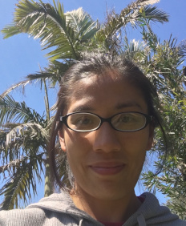
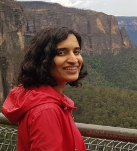
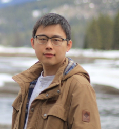
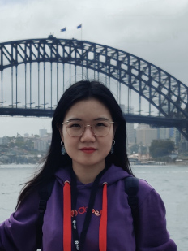
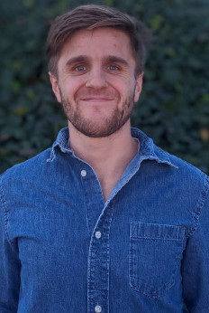
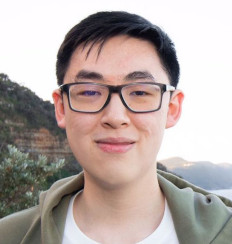
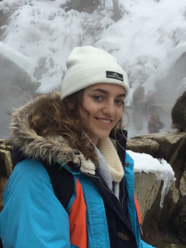

title: People
slug: people
category: pages
order: 3
date: 2019-12-02
template: people

<!--
<h1>Team</h1>
-->

<h2>Fabio Zanini</h2>

<a href="mailto:fabio.zanini@unsw.edu.au">fabio DOT zanini AT unsw DOT edu DOT&nbsp;au</a>

<ul>
<li><a href="../images/fabio_zanini_cv.pdf"><strong>Curriculum&nbsp;Vitae</strong></a></li>
<li><a href="https://research.unsw.edu.au/people/dr-fabio-zanini"><strong>UNSW&nbsp;profile</strong></a></li>
</ul>

I love single cell biology, data science, graphs, coding, fighting viral infections, the immune system, and rock&nbsp;climbing.

<h2>Givanna&nbsp;Putri</h2>

co-supervised: <a href="https://medicalsciences.med.unsw.edu.au/people/associate-professor-john-pimanda">John Pimanda</a>

<a href="mailto:g.putri@unsw.edu.au">g DOT putri AT unsw DOT edu DOT au</a>

I am a postdoctoral research fellow with passion for single cell omics and computational biology, specifically using data science techniques to analyse multi-omics data and investigate biological system. When not working, I enjoy mountain biking, painting, travelling, and listening to blues and jazz music.

<h2>Kanu&nbsp;Wahi</h2>

co-supervised: <a href="https://medicalsciences.med.unsw.edu.au/people/associate-professor-jeff-holst">Jeff Holst</a> and <a href="https://www.ccia.org.au/molecular-targets-and-cancer-therapeutics/metal-targeted-therapy-and-immunology">Orazio Vittorio</a>

<a href="mailto:k.wahi@unsw.edu.au">k DOT wahi AT unsw DOT edu DOT au</a>

I am a postdoctoral research fellow with a keen interest in identifying resistance mechanisms in aggressive subtypes of breast cancer caused by dysregulation at the transcript level through to the metabolic level. Apart from work, I enjoy going for bike rides and bush walks.

<h2>Zhiyuan&nbsp;Yao</h2>

co-supervised: <a href="https://med.stanford.edu/einavlab/people.html">Shirit Einav</a> @&nbsp;Stanford

<a href="mailto:yzhiyuan@stanford.edu">yzhiyuan AT stanford DOT&nbsp;edu</a>

I am a postdoctoral scholar with an interest in single cell biology and virology, especially using single cell transcriptomic tools
to investigate virus-host interplay in severe&nbsp;dengue.

<h2>Toni Rose&nbsp;Jue</h2>

co-supervised: <a href="https://medicalsciences.med.unsw.edu.au/people/associate-professor-jeff-holst">Jeff Holst</a>

<a href="mailto:t.jue@unsw.edu.au">t DOT jue AT unsw DOT edu DOT&nbsp;au</a>

I am a postdoctoral scholar and my research interest revolve around the use of next generation sequencing technologies
to understand the mechanisms of immunotherapeutic strategies for malignant primary brain tumours, specifically glioblastoma.
Beyond work, I love travelling and exploring the outdoors with my husband and&nbsp;daughter.

<h2>Yike&nbsp;Xie</h2>

<a href="mailto:yike.xie@unsw.edu.au">yike DOT xie AT unsw DOT edu DOT&nbsp;au</a>

I am a PhD student and my background is in pharmacy. My research interests are data analysis and single cell sequencing.
Outside of work, I like reading and&nbsp;traveling.

<h2>Carsten&nbsp;Knutsen</h2>

co-supervised: <a href="https://med.stanford.edu/alviralab/about.html">Cristina Alvira</a> @&nbsp;Stanford

<a href="mailto:cknutsen@stanford.edu">cnutsen AT stanford DOT&nbsp;edu</a>

I am excited about studying and elucidating complex biological systems. I enjoy working with large datasets such as high-throughput screens and single-cell data. Outside of the lab, I like to spend my time mountain biking, rock climbing, and baking.

<h2>Kevin&nbsp;Zhu</h2>

<a href="mailto:kv.zhu999@gmail.com">kv DOT zhu999AT gmail DOT&nbsp;com</a>

I'm a undergraduate student with an interest in computer science and mathematics, particularly when I'm able to visualise the data that I'm working with! Outside of work, I love to draw and play Overwatch with my friends.

<h2>Catherine&nbsp;Gatt</h2>

<a href="mailto:c.gatt@student.unsw.edu.au">c DOT gattAT student DOT unswDOT edu DOT&nbsp;au</a>

I am an undergraduate student with a keen interest in computational biology, single-cell transcriptomics and evolution.  Beyond studying, I love scuba diving and hiking. 

<!--

# Principal Investigator
## Fabio Zanini

[fabio DOT zanini AT unsw DOT edu DOT au](mailto:fabio.zanini@unsw.edu.au)

- [**Curriculum Vitae**]({static}/images/fabio_zanini_cv.pdf)
- [**UNSW profile**](https://research.unsw.edu.au/people/dr-fabio-zanini)

I love single cell biology, data science, fighting viral infections, the immune system, and rock climbing.

# Team
## Kanu Wahi
(co-supervised with [Jeff Holst](https://medicalsciences.med.unsw.edu.au/people/associate-professor-jeff-holst) at UNSW and [Orazio Vittorio](https://www.ccia.org.au/molecular-targets-and-cancer-therapeutics/metal-targeted-therapy-and-immunology) at CCIA)

I am a postdoctoral research fellow with a keen interest in identifying resistance mechanisms in aggressive subtypes of breast cancer caused by dysregulation at the transcript level through to the metabolic level. Apart from work, I enjoy going for bike rides and bush walks.

## Zhiyuan Yao
(co-advised with [Shirit Einav](https://med.stanford.edu/einavlab/people.html) at Stanford)

[yzhiyuan AT stanford DOT edu](mailto:yzhiyuan@stanford.edu)

I am a postdoctoral scholar with an interest in single cell biology and virology, especially using single cell transcriptomic tools
to investigate virus-host interplay in severe dengue.

## Toni Rose Jue
(co-advised with [Jeff Holst](https://medicalsciences.med.unsw.edu.au/people/associate-professor-jeff-holst) at UNSW)

[t DOT jue AT unsw DOT edu DOT au](mailto:t.jue@unsw.edu.au)

I am a postdoctoral scholar and my research interest revolve around the use of next generation sequencing technologies
to understand the mechanisms of immunotherapeutic strategies for malignant primary brain tumours, specifically glioblastoma.
Beyond work, I love travelling and exploring the outdoors with my husband and daughter.

## Yike Xie

[yike DOT xie AT unsw DOT edu DOT au](mailto:yike.xie@unsw.edu.au)

I am a PhD student and my background is in pharmacy. My research interests are data analysis and single cell sequencing.
Outside of work, I like reading and traveling.

-->

# Alumni
- [Viraj Kapoor](mailto:viraj.kapoor@student.unsw.edu.au): sex differences in neonatal lung disease, now medical student @[UNSW](https://www.unsw.edu.au/).
- [Ying (Christine) Xu](mailto:yingxu0928@gmail.com): dengue antibody intern, now student at @[UNSW](https://www.unsw.edu.au/).
- [Carsten Knutsen](mailto:cknutsen@stanford.edu): neonatal lung research professional, then research associate @[Recombinetics](https://recombinetics.com/) (now back with us!). 
- [Paula Klavina](mailto:klavinap@tcd.ie): neonatal lung intern, now PhD student @[RCSI (Ireland)](https://www.rcsi.com/)
- [Yasir Kusay](mailto:y.kusay@student.unsw.edu.au): [igraph](https://igraph.org/) development intern, now student @[UNSW](https://www.unsw.edu.au/)

# Other collaborations
- [David Cornfield, Stanford University](http://med.stanford.edu/cornfieldlab/Home.html)
- [John Pimanda, UNSW Lowy Cancer Research Centre](https://powcs.med.unsw.edu.au/people/associate-professor-john-pimanda)

# Friends
Some friendly labs that are full of smart, kind people:

 [cazencotte](https://cazencott.info/) 
 [neherlab](https://neherlab.org) 
 [Einav lab](http://med.stanford.edu/einavlab.html) 
 [The Big One](https://quakelab.stanford.edu) 
 [Alvira lab](http://med.stanford.edu/alviralab.html) 
 [bedford.io](https://bedford.io/) 
 [Goo Lab](https://research.fhcrc.org/goo/en.html) 
 [ciralab](http://www.ciralab.rowland.harvard.edu/) 
 [Bloom lab](https://research.fhcrc.org/bloom/en.html) 
